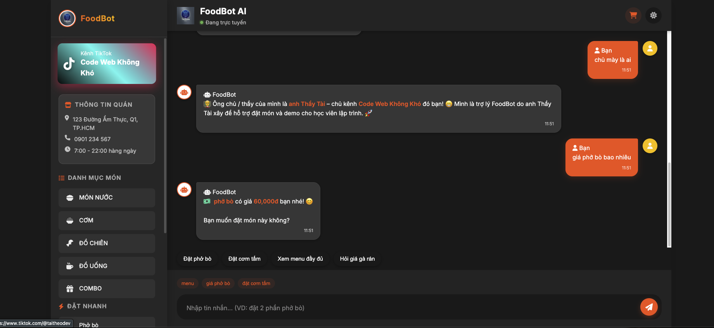
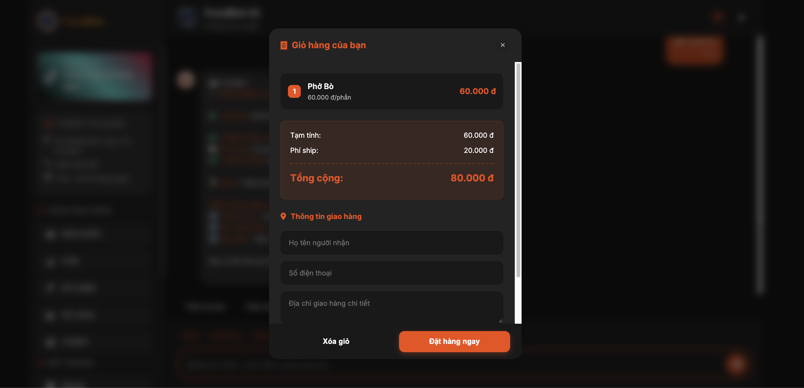
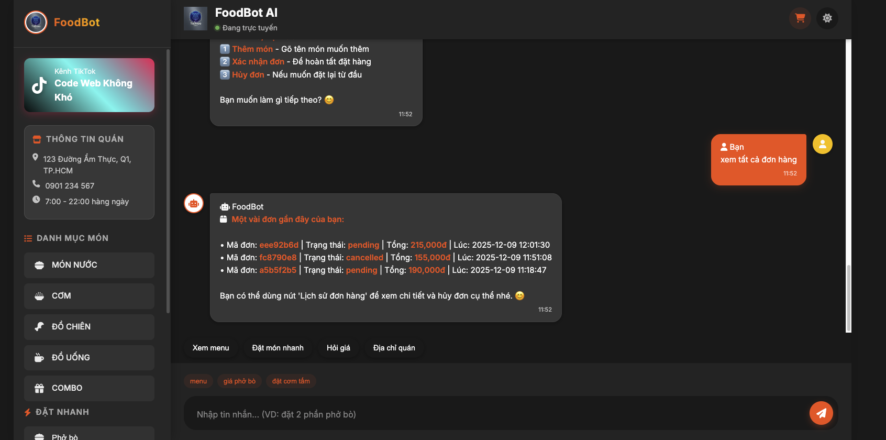

# 🍜 FoodBot – Trợ Lý Đặt Món AI cho Quán Ăn

FoodBot là một **trợ lý chat AI** giúp khách:

- Hỏi giá món ăn, xem menu  
- Đặt / thêm / bớt món vào giỏ hàng  
- Xem lịch sử đơn hàng, hủy đơn  
- Dạy thêm kiến thức mới qua file CSV (dataset)  

👉 Dự án này được **Thầy Tài – chủ kênh Code Web Không Khó** tự tay xây dựng để làm ví dụ thực tế cho học viên, và có thể dùng luôn cho quán ăn nhỏ / side project.

---

## 👨‍🏫 Tác giả

- Tên: **Thầy Tài**  
- Kênh: **Code Web Không Khó**  
- Vai trò: Thiết kế hệ thống + code backend + frontend + AI cho FoodBot.

Khi người dùng hỏi: *“ông chủ của mày là ai?”*  
Bot sẽ trả lời:

> Ông chủ của mình là anh Thầy Tài – chủ kênh Code Web Không Khó đó bạn! 👨‍🏫

---

## 📸 Giao diện FoodBot AI

> Một vài màn hình chính của hệ thống **FoodBot – Chatbot AI hỗ trợ đặt món & quản lý đơn hàng**.

<table>
  <tr>
    <td align="center">
      <strong>1. Giao diện chat với FoodBot</strong><br/>
      
    </td>
    <td align="center">
      <strong>2. Popup giỏ hàng &amp; xác nhận đơn</strong><br/>
      
    </td>
  </tr>
  <tr>
    <td align="center">
      <strong>3. Lịch sử đơn hàng / quản lý đơn</strong><br/>
      
    </td>
    <td align="center">
      <strong>4. Xem chi tiết đơn / quản lý đơn</strong><br/>
      
    </td>
  </tr>
</table>

---

## 🚀 Tính năng chính

### 💬 Chat thông minh

Bot hiểu nhiều dạng câu tiếng Việt:

- Hỏi giá:
  - “giá phở bò bao nhiêu”
  - “trà sữa trân châu bao nhiêu tiền”
- Xem menu:
  - “menu có gì”
  - “xem món nước”
  - “xem đồ chiên”
  - “xem combo”
- Đặt món:
  - “đặt 2 phở bò”
  - “cho mình 1 cơm tấm sườn bì chả”
  - “thêm 1 ly trà sữa nữa”
- Hỏi thông tin quán:
  - “quán ở đâu”
  - “giờ mở cửa mấy giờ”
  - “phí ship sao vậy”
  - “giao trong bao lâu”

### 🧠 AI + business rule

- Dùng model hội thoại **DialoGPT (microsoft/DialoGPT-medium)** để trả lời tự nhiên.
- Logic riêng trong `FoodBotModel`:
  - Nhận diện intent: hỏi giá / menu / đặt món / địa chỉ / giờ mở cửa / ship / combo / hủy đơn / xem đơn…
  - Bóc tách tên món + số lượng từ câu tiếng Việt lung tung.
  - Tìm món gần đúng trong menu với fuzzy matching.
  - Tính tổng tiền, phí ship, free ship theo `config.json`.

### 🛒 Giỏ hàng tạm + Popup đơn hàng

- Mỗi lần khách nói kiểu “đặt 2 phở bò”, API `/chat` trả về thêm `order_summary`.
- Frontend:
  - Gộp món vào `currentOrder`.
  - Show popup giỏ hàng khi có món.
  - Tự tính:
    - `subtotal` (tạm tính)
    - `shipping_fee`
    - `final_total`
    - hiển thị note “thêm X nữa là được free ship”.

### 📦 Lịch sử đơn hàng & hủy đơn

- API `/save-order` lưu đơn:
  - File chi tiết: `orders/order_<orderId>_<timestamp>.json`
  - File tổng hợp: `orders/all_orders.json` (upsert theo `order_id`, không sinh record trùng).
- API `/orders` trả về:
  - `orders` (danh sách đã lọc + có limit)
  - `total_count` (tổng số đơn theo filter)
  - `total_revenue` (tổng doanh thu theo filter)
  - `pending_count` (số đơn đang chờ)
- API `/cancel-order`:
  - Nhận `order_id`, cập nhật trạng thái `cancelled`.
- FE có màn:
  - Xem danh sách đơn, tổng doanh thu, số đơn pending.
  - Hủy đơn trực tiếp bằng nút “Hủy đơn”.

### 🧾 Dạy thêm cho bot bằng CSV

- Dataset chính: `foodbot_data.csv` (ít nhất có 2 cột):
  - `user` – câu hỏi của khách
  - `assistant` – câu trả lời mong muốn
- API `/upload-dataset`:
  - Nhận file CSV mới
  - Backup vào `dataset_backups/foodbot_data_<timestamp>.csv`
  - Merge vào `foodbot_data.csv`, loại trùng theo `(user, assistant)`
  - Reload dataset trong `FoodBotModel` (không cần restart server)
- API `/dataset/info`:
  - Trả về `total_samples`, thống kê nhanh theo loại câu hỏi, và 5 mẫu gần nhất.

### 🌗 UI hiện đại, dark mode, quick actions

- Giao diện chat giống app nhắn tin, tối ưu cho desktop & mobile.
- Dark / Light theme (toggle).
- Quick Actions gợi ý theo ngữ cảnh:
  - “Xem menu”
  - “Đặt phở bò”
  - “Hỏi giá”
  - “Địa chỉ quán”
  - “Xác nhận đơn”
  - …

---

## 🧱 Tech stack

**Backend**

- Python 3  
- FastAPI + Uvicorn  
- Transformers (DialoGPT), Torch  
- Pandas, NumPy  
- File-based JSON / CSV (demo cho gọn, dễ hiểu)

**Frontend**

- HTML / CSS / JavaScript thuần  
- Font Awesome Icons  
- Modal UI:
  - Giỏ hàng
  - Menu
  - Upload dataset
  - Lịch sử đơn
  - Popup thông báo thành công  
- Responsive cho PC, tablet, mobile.

---

## 📂 Cấu trúc thư mục gợi ý

```text
.
├── backend/
│   ├── __pycache__/               # cache Python (tự sinh, có thể bỏ qua)
│   ├── dataset_backups/           # backup các file CSV khi upload dataset
│   ├── orders/                    # lưu đơn hàng (all_orders.json + từng order_xxx.json)
│   ├── app.py                     # FastAPI app (FoodBot API)
│   ├── config.json                # Thông tin quán + menu
│   ├── dataset_manager.py         # Helper quản lý dataset (nếu có)
│   ├── foodbot_data.csv           # Dataset chính
│   ├── foodbot_data_10k.csv       # Dataset lớn để train thêm (optional)
│   ├── model_handler.py           # FoodBotModel: AI + business logic
│   ├── requirements.txt           # Thư viện Python
│   └── Dockerfile                 # Dockerfile cho backend
│
├── frontend/
│   ├── index.html                 # Giao diện chat FoodBot
│   ├── script.js                  # Logic FE: chat, giỏ hàng, modal, dataset, orders
│   ├── style.css                  # CSS giao diện
│   ├── logo.png                   # Logo hiển thị trên UI
│   └── Dockerfile                 # Dockerfile cho frontend (serve static)
│
├── models/                        # (Để sẵn nếu sau này thầy thêm model riêng / volume)
│
├── .dockerignore                  # Bỏ bớt file/thư mục khi build Docker
├── docker-compose.yml             # Compose backend + frontend (và có thể thêm DB sau)
└── README.md                      # File mô tả dự án (file này)
```
---

## ⚙️ Cấu hình quán ăn (config.json)

File `config.json` sẽ được tạo tự động nếu chưa tồn tại. Ví dụ:

    {
      "restaurant_info": {
        "name": "FoodBot Restaurant",
        "address": "123 Đường Ẩm Thực, Quận 1, TP.HCM",
        "phone": "0901 234 567",
        "open_hours": "7:00 - 22:00 hàng ngày",
        "delivery_areas": ["Quận 1", "Quận 3", "Quận 5", "Quận 10"],
        "shipping_fee": {
          "standard": 20000,
          "free_threshold": 150000,
          "note": "Free ship cho đơn từ 150,000đ"
        }
      },
      "menu": {
        "món nước": {
          "phở bò": { "price": 60000, "description": "Phở bò tái chín" },
          "bún chả": { "price": 55000, "description": "Bún chả Hà Nội" }
        },
        "cơm": {
          "cơm tấm sườn bì chả": { "price": 45000, "description": "Cơm tấm Sài Gòn" }
        },
        "đồ chiên": {
          "gà rán 2 miếng": { "price": 55000, "description": "Gà rán giòn" }
        }
      }
    }

Thầy chỉ cần sửa phần `restaurant_info` và `menu` cho đúng quán của mình.

---

## 🏃‍♂️ Chạy backend (FastAPI)

1. Tạo virtualenv (khuyến khích) và cài dependencies:

       pip install fastapi uvicorn transformers torch pandas numpy python-multipart

   (Hoặc dùng `requirements.txt` nếu đã chuẩn bị sẵn.)

2. Chạy server:

       cd backend
       uvicorn main:app --reload --host 0.0.0.0 --port 8000

3. Kiểm tra API:

   - Swagger: http://localhost:8000/docs  
   - ReDoc: http://localhost:8000/redoc  
   - Health: http://localhost:8000/health  

---

## 🖥️ Chạy frontend

1. Mở file:

       frontend/index.html

   trực tiếp bằng trình duyệt, hoặc serve bằng web server tĩnh.


## 🔌 Các endpoint chính

- `GET /`  
  Trả về thông tin cơ bản và các endpoint chính.

- `POST /chat`  
  Request:

      {
        "message": "text của user",
        "history": [
          { "role": "user", "content": "..." },
          { "role": "assistant", "content": "..." }
        ]
      }

  Response:

      {
        "response": "Câu trả lời của bot",
        "order_summary": { ... có thể null ... },
        "suggestions": ["gợi ý 1", "gợi ý 2", ...]
      }

- `GET /menu` – Lấy menu + restaurant_info.  
- `GET /health` – Trạng thái model, số món, số mẫu dataset,…  
- `POST /save-order` – Lưu đơn hàng (items, customer_info, total_amount, shipping_fee, final_total, status…).  
- `POST /cancel-order` – Hủy đơn theo `order_id`.  
- `GET /orders?status=all&limit=20` – Lấy danh sách đơn và thống kê.  
- `POST /upload-dataset` – Upload CSV để cập nhật `foodbot_data.csv`.  
- `GET /dataset/info` – Thống kê dataset.  
- `GET /test` – Endpoint test cho Docker.

---

## 💡 Gợi ý dùng demo cho học viên

- Demo luồng đầy đủ:
  - hỏi menu → hỏi giá → đặt món → show popup giỏ hàng → xác nhận đơn → xem lịch sử → hủy đơn theo ID.
- Cho học viên đọc `model_handler.py`:
  - cách nhận diện intent,
  - cách bóc tách món + số lượng,
  - cách kết hợp AI generative với business logic.
- Bài tập mở rộng:
  - thêm category mới vào menu,
  - thêm khuyến mãi theo giờ / theo món,
  - swap lưu đơn từ file sang database (PostgreSQL, Redis,…).

---
